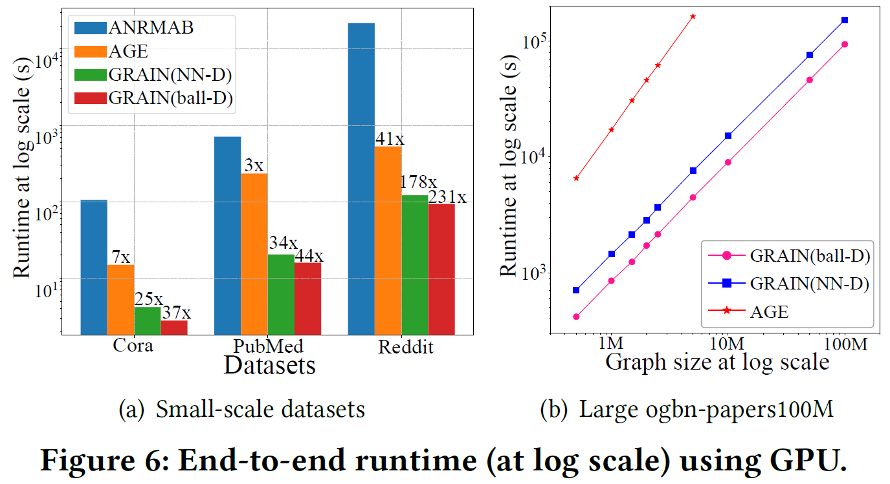
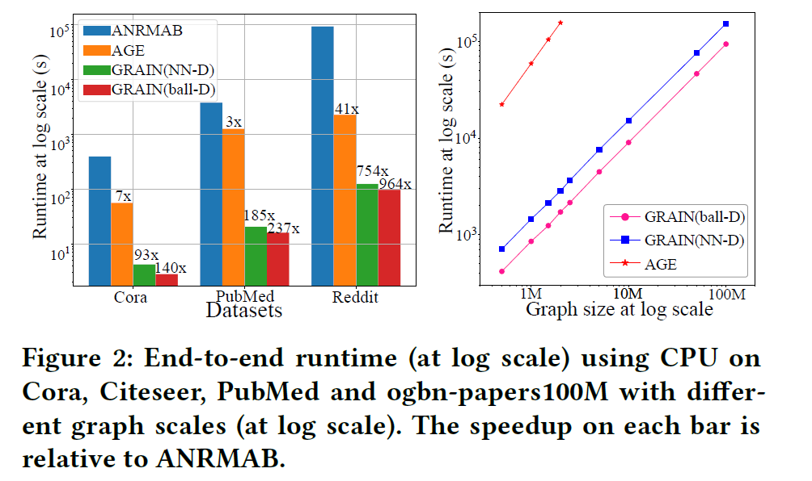
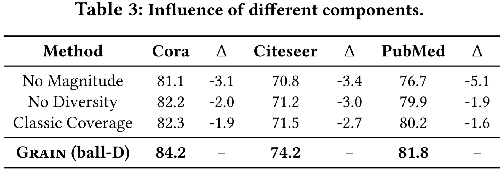
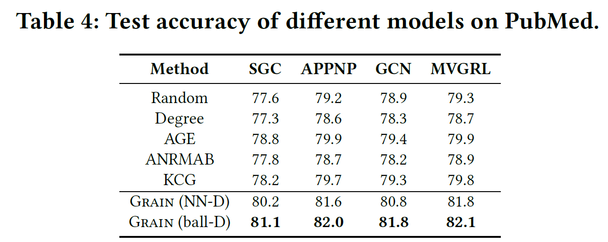

# Grain: Improving Data Efficiency of Graph Neural Networks via Diversified Influence Maximization.

This repository is the official implementation of GRAIN. 

## Requirements

To install requirements:

```setup
pip install -r requirements.txt
```


## Training

To train the model(s) in the paper:


> cd the  “example” data

>run the python file GRAIN(ball-D).py or GRAIN(NN-D).py


## Results

1. Accuracy comparison:


2. Active learning comparison:


3. Core-set selection comparison:


4. Efficiency comparison on GPU:



5. Efficiency comparison on CPU:



6. Interpretability:


7. Ablation study:



8. Generalization:


