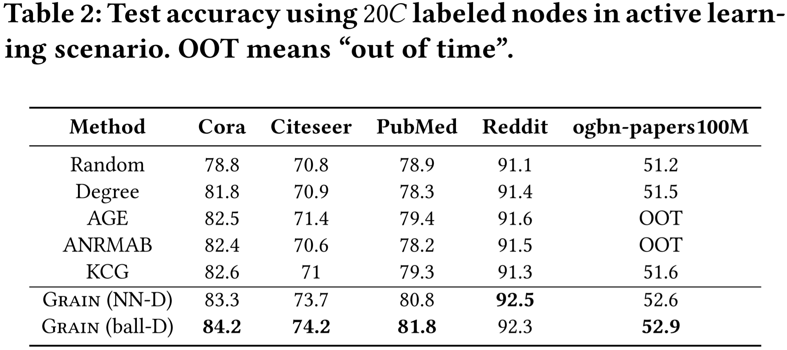

# Grain: Improving Data Efficiency of Graph Neural Networks via Diversified Influence Maximization.

This repository is the official implementation of GRAIN. 

## Requirements

To install requirements:

```setup
pip install -r requirements.txt
```


## Training

To train the model(s) in the paper:
> cd the  “example” directory

>run the python file GRAIN(ball-D).py or GRAIN(NN-D).py

You can also see the experiment results in the notebook:
> cd the  “example” directory

>run the notebook file Test.ipynb

## Results

1. Accuracy comparison:



2. Active learning comparison:


3. Core-set selection comparison:


4. Efficiency comparison:


5. Interpretability:


